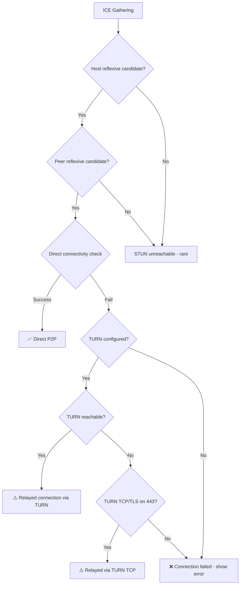

# nerdShare — Security Model & Failure Scenarios

> How nerdShare protects user data and handles real-world failures gracefully.

---

## Part 1: Security Model

### 1.1 Threat Model

nerdShare's threat model assumes:

| Assumed Trusted                         | Assumed Untrusted          |
| --------------------------------------- | -------------------------- |
| Host's browser                          | Network intermediaries     |
| Peer's browser                          | ISPs, corporate proxies    |
| STUN/TURN servers (operator-controlled) | Other peers on the network |
| Signaling server (we operate it)        | —                          |

**Out of scope for MVP**: Malicious signaling server, man-in-the-middle on the signaling channel.

### 1.2 Encryption

#### In-Transit Encryption (Mandatory)

WebRTC provides **DTLS** (Datagram Transport Layer Security) encryption on all DataChannel traffic:

- **Automatic**: No opt-in required — DTLS is mandatory per WebRTC spec
- **Peer-to-peer keys**: DTLS handshake generates session keys between peers directly
- **No server access**: The signaling server never sees the encryption keys
- **Forward secrecy**: DTLS supports ephemeral key exchange

```
File bytes → SCTP framing → DTLS encryption → ICE transport → Network
```

#### What DTLS Does NOT Protect Against

| Threat                          | Protection                                                   |
| ------------------------------- | ------------------------------------------------------------ |
| Eavesdropping on file data      | ✅ Protected (DTLS)                                          |
| Tampering with file data        | ✅ Protected (DTLS integrity)                                |
| Signaling server reads SDP      | ❌ SDP is plaintext (contains ICE candidates, not file data) |
| Malicious peer fingerprinting   | ❌ Not addressed in MVP                                      |
| File data stored on peer device | ❌ Out of scope (browser security model)                     |

#### Phase 5+ Enhancement: End-to-End Verification

Optionally verify DTLS fingerprints via the signaling channel:

```typescript
// Host includes DTLS fingerprint in offer metadata
// Peer verifies fingerprint matches after DTLS handshake
// This prevents MITM even if signaling server is compromised
```

### 1.3 Access Control

#### MVP: Link-Based Access (Capability URL)

```
https://nerdshare.com/#/r/<roomId>
```

- Anyone with the link can join the room
- No authentication required
- Works for quick, trusted sharing

**Trade-off**: If the link leaks, anyone can join. Acceptable for the use case (similar to Google Docs "anyone with the link").

#### Phase 5+: Capability Secret

```
https://nerdshare.com/#/r/<roomId>?k=<roomSecret>
```

- `roomSecret` is a random token generated at room creation
- Server stores `hash(roomSecret)`, never the plaintext
- Peer must present the correct secret to join
- Adds protection against room ID enumeration

#### Phase 5+: Host Approval Mode

```
Host gets notification: "peer-1 wants to join"
Host clicks: [Approve] or [Reject]
```

### 1.4 Privacy

| Data             | On Server?                 | On Network?          |
| ---------------- | -------------------------- | -------------------- |
| File content     | ❌ Never                   | Encrypted (DTLS) P2P |
| File name        | ❌ Never (sent over DC)    | Encrypted (DTLS) P2P |
| File size        | ❌ Never (sent over DC)    | Encrypted (DTLS) P2P |
| Room ID          | ✅ Ephemeral               | In WS messages       |
| User ID          | ✅ Ephemeral (random UUID) | In WS messages       |
| IP addresses     | ✅ In ICE candidates       | In SDP/ICE           |
| SDP offer/answer | ✅ Relayed                 | In WS messages       |

**IP Address Exposure**: ICE candidates contain the peer's IP address. This is inherent to WebRTC and cannot be avoided without TURN-only mode (which breaks performance). Documented in privacy policy.

### 1.5 Abuse Prevention

| Threat              | Mitigation                              |
| ------------------- | --------------------------------------- |
| Room spam           | Rate limit: max N rooms per IP per hour |
| Connection flooding | Max peers per room (MVP: 1, later: 5)   |
| Stale rooms         | TTL: 30-minute auto-expiry              |
| Message flooding    | Max message size on signaling (10 KB)   |
| WebSocket abuse     | Connection timeout, message rate limit  |
| Resource exhaustion | Room count limit per server instance    |

```typescript
// Server-side rate limiting (simple)
const roomsPerIp = new Map<string, { count: number; resetAt: number }>();
const MAX_ROOMS_PER_IP = 10;
const RATE_WINDOW_MS = 60 * 60 * 1000; // 1 hour

function checkRateLimit(ip: string): boolean {
  const entry = roomsPerIp.get(ip);
  if (!entry || Date.now() > entry.resetAt) {
    roomsPerIp.set(ip, { count: 1, resetAt: Date.now() + RATE_WINDOW_MS });
    return true;
  }
  if (entry.count >= MAX_ROOMS_PER_IP) return false;
  entry.count++;
  return true;
}
```

---

## Part 2: Failure Scenarios & Graceful Degradation

### 2.1 NAT Traversal Failure

**Problem**: ~10–15% of connections fail direct P2P due to NAT types.



**UI Behavior**:

| State      | User Sees                                                                             |
| ---------- | ------------------------------------------------------------------------------------- |
| Direct P2P | "Connected directly" + green indicator                                                |
| TURN relay | "Connected via relay" + yellow indicator                                              |
| Failed     | "Connection failed. Both parties may be behind restrictive firewalls." + retry button |

**MVP (No TURN)**: Show honest error. Document that TURN is coming.

**Phase 5+**: Deploy coturn with UDP + TCP/TLS fallback on port 443.

### 2.2 Peer Disconnects Mid-Transfer

**Cause**: Tab close, browser crash, network drop, laptop sleep.

**Detection**:

- `pc.onconnectionstatechange` → `"disconnected"` or `"failed"`
- `dc.onclose` fires
- Signaling server sends `PEER_LEFT`

**Host Response (MVP)**:

```typescript
pc.onconnectionstatechange = () => {
  if (pc.connectionState === "disconnected") {
    // Wait for possible reconnection (30s timeout)
    startReconnectTimer(peerId, 30_000);
  }
  if (pc.connectionState === "failed") {
    // Unrecoverable — clean up
    cleanupPeerSession(peerId);
    updateUI("peer_disconnected", peerId);
  }
};
```

**UI**: "Peer disconnected. Waiting for reconnection…" → after timeout → "Transfer failed. Peer left."

**MVP Limitation**: Transfer progress is lost. Re-transfer from beginning on reconnect.

### 2.3 Host Disconnects

**Impact**: File source is gone. All transfers are unrecoverable.

**Server Action**:

1. Detect host WS close
2. Remove room immediately
3. Send `PEER_LEFT` to all remaining peers

**Peer UI**: "Host disconnected. File is no longer available."

**No mitigation possible** — the file only exists in the host's browser.

### 2.4 Signaling Server Down

**Impact**: New connections cannot be established. Existing DataChannel connections continue working.

| Already Connected                               | Not Yet Connected            |
| ----------------------------------------------- | ---------------------------- |
| ✅ Transfer continues (P2P pipe is independent) | ❌ Cannot exchange SDP/ICE   |
| ⚠️ Can't add new peers                          | ❌ Show "server unreachable" |

**Mitigation**:

- Client retry with exponential backoff (up to 30s)
- Clear error messaging
- Phase 6+: Multiple signaling server instances behind load balancer

### 2.5 Browser Memory Exhaustion

**Problem**: Receiving a 2 GB file accumulates 2 GB of `ArrayBuffer` in memory.

**Symptoms**: Page becomes unresponsive → browser may kill the tab.

**MVP Mitigations**:

| Strategy           | Implementation                         |
| ------------------ | -------------------------------------- |
| File size warning  | Show warning for files > 500 MB        |
| Max file size      | Reject files > 2 GB at selection       |
| Garbage collection | Set `chunks.length = 0` after download |

**Phase 4+**: Use File System Access API to stream chunks directly to disk.

### 2.6 Slow Network / Throttled Connection

**Problem**: Transfer speed drops to very low values.

**Behavior**:

- Backpressure mechanism handles this automatically
- `bufferedAmount` stays low (data drains slowly but safely)
- Progress bar moves slowly but honestly

**UI Enhancement**:

```typescript
// Stall detection
if (speed < 10_000 && Date.now() - lastProgressUpdate > 30_000) {
  showWarning("Transfer is very slow. Network may be congested.");
}
```

### 2.7 WebSocket Message Size Rejection

**Problem**: SDP offers for complex ICE scenarios can be large.

**Mitigation**:

- Set server max message size to 64 KB (SDP rarely exceeds 10 KB)
- Log and drop oversized messages
- Send `ERROR` with `code: "MESSAGE_TOO_LARGE"`

### 2.8 Failure Summary Matrix

| Failure           | Detection              | MVP Response       | Phase 5+ Response      |
| ----------------- | ---------------------- | ------------------ | ---------------------- |
| NAT traversal     | ICE failed state       | Error + retry      | TURN fallback          |
| Peer disconnect   | connectionState change | Clean up + error   | Resume from last chunk |
| Host disconnect   | WS close               | Room removed       | N/A (no fix possible)  |
| Signaling down    | WS error/close         | Retry with backoff | Redundant servers      |
| Memory exhaustion | Browser limits         | Size warnings      | File System Access API |
| Slow network      | Speed tracking         | Honest progress    | Adaptive chunk size    |
| Invalid messages  | JSON parse error       | Log + ignore       | Rate limit + ban       |
