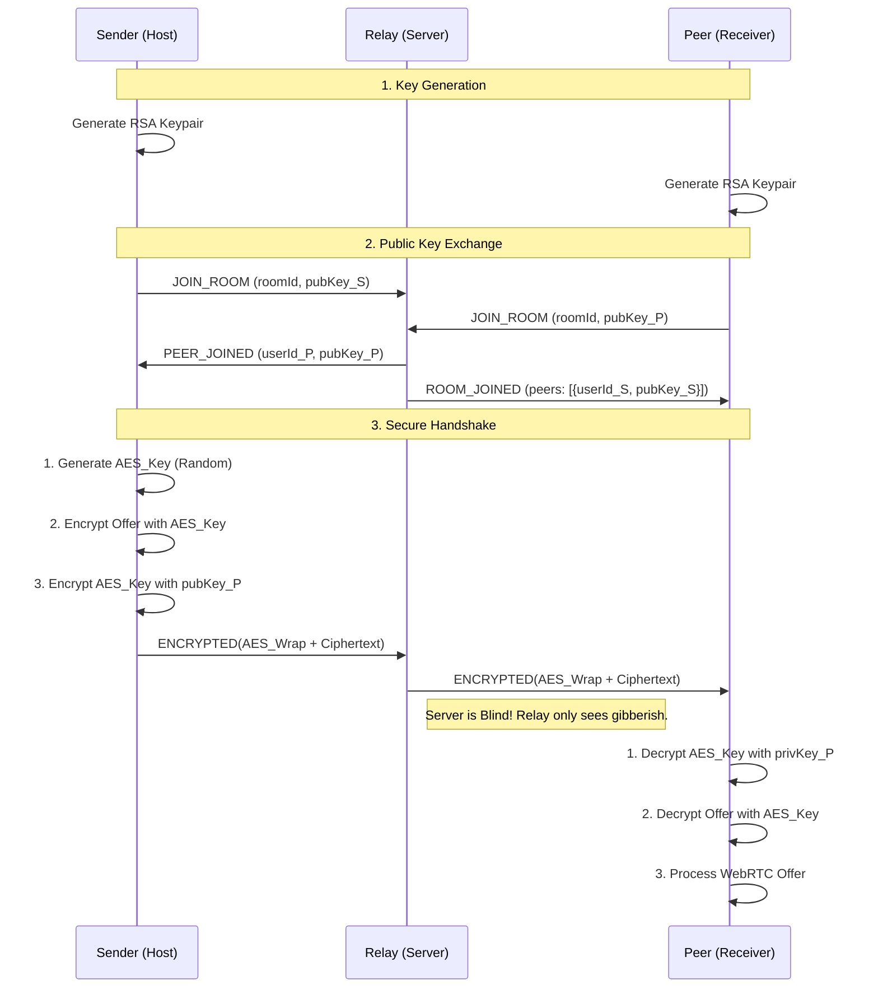

# Zero-Knowledge Signaling: Technical Architecture

This document explains the End-to-End Encryption (E2EE) architecture implemented in nerdShare to ensure the signaling server remains a "blind relay."

---

## 1. The Core Challenge: RSA is "Microscopic"

When first implementing encryption, we used **RSA-OAEP**. However, RSA is mathematically limited in how much data it can encrypt at once.

- **The Key Size:** We use 2048-bit RSA keys.
- **The Overhead:** The OAEP padding (required for security) takes up significant space.
- **The Limit:** For a 2048-bit key with SHA-256 hashing, the maximum payload size is exactly **190 bytes**.

**The Crash:**
WebRTC signaling messages—specifically the **SDP Offer/Answer**—are massive. They contain media descriptions, ICE candidates, and security fingerprints, often reaching **3,000+ bytes**. Attempting to encrypt these directly with RSA throws a `DataError: Message is too large` in the browser, causing the signaling handshake to fail silently.

---

## 2. Key Terms

### RSA-OAEP (Asymmetric)

- **Type:** Asymmetric (Public/Private key pair).
- **Usage:** Used to establish trust and exchange secrets.
- **Pros:** Only the recipient needs their Private Key to read a message sent to their Public Key. No pre-shared secret is needed.
- **Cons:** Extremely slow and handles very small data amounts.

### AES-GCM (Symmetric)

- **Type:** Symmetric (Single shared key).
- **Usage:** Used to encrypt the actual bulk data (SDP Offers, ICE candidates).
- **Pros:** Blisteringly fast, hardware-accelerated, and handles infinite data sizes.
- **GCM Mode:** Includes a "check-sum" (authentication tag) to ensure the message wasn't tampered with during transit.

---

## 3. The Solution: Hybrid Encryption

We use a "Hybrid" model, which is the gold standard used by PGP and TLS (HTTPS). We use RSA to solve the "key exchange" problem and AES to solve the "data size" problem.

### The Send Orchestration (`encryptPayload`)

1.  **Generate Session Key:** On every single message, the sender generates a random 256-bit **AES Key**.
2.  **Symmetric Encryption:** The large Signal Payload is encrypted using **AES-GCM** with this temporary key.
3.  **Key Wrapping:** The temporary AES key is encrypted using the recipient's **RSA Public Key**.
4.  **Enveloping:** We bundle the `encryptedAESKey`, the `iv` (Initial Vector), and the `ciphertext` into a JSON envelope.

### The Receive Orchestration (`decryptPayload`)

1.  **Unwrap Key:** The recipient uses their **RSA Private Key** to decrypt (unwrap) the AES session key.
2.  **Symmetric Decryption:** They use that recovered AES key to decrypt the large bulk payload.
3.  **Validate & Parse:** The decrypted JSON is parsed back into a WebRTC signal.

---

## 4. Architectural Flow

## Summary of Benefits

- **Complete Privacy:** Even if the signaling server is malicious, it can never learn your IP address (SDP) or the file names being discussed.
- **Scalability:** Because AES is hardware-accelerated, there is zero perceptible lag during the encryption process.
- **Standardized:** Replicates the architecture found in battle-tested projects like `filedrop` and `ToffeeShare`.
