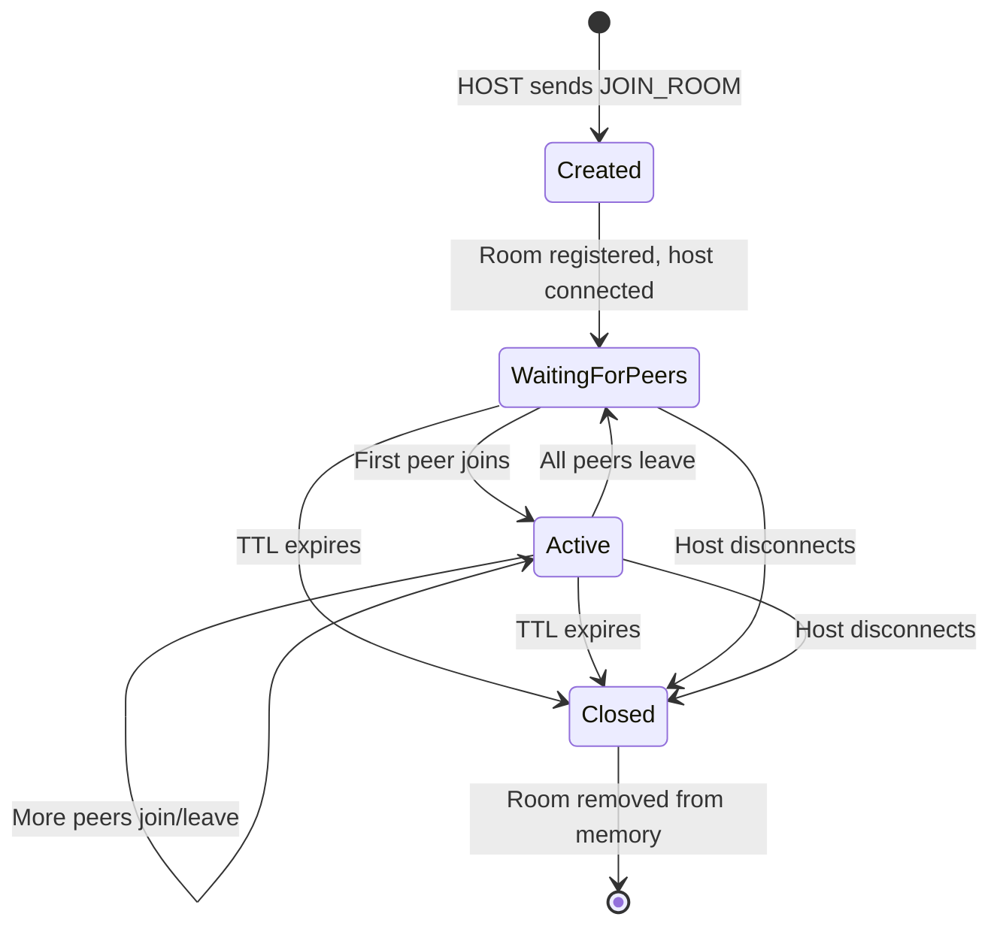
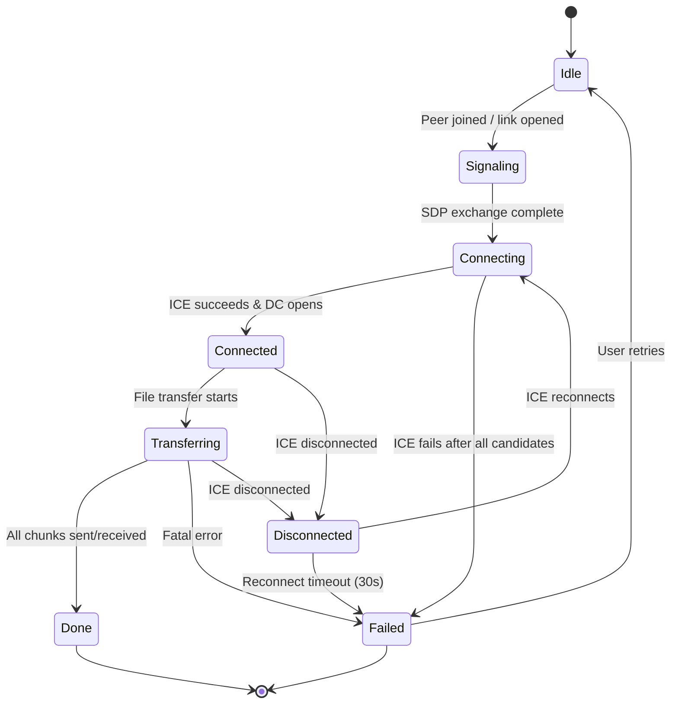
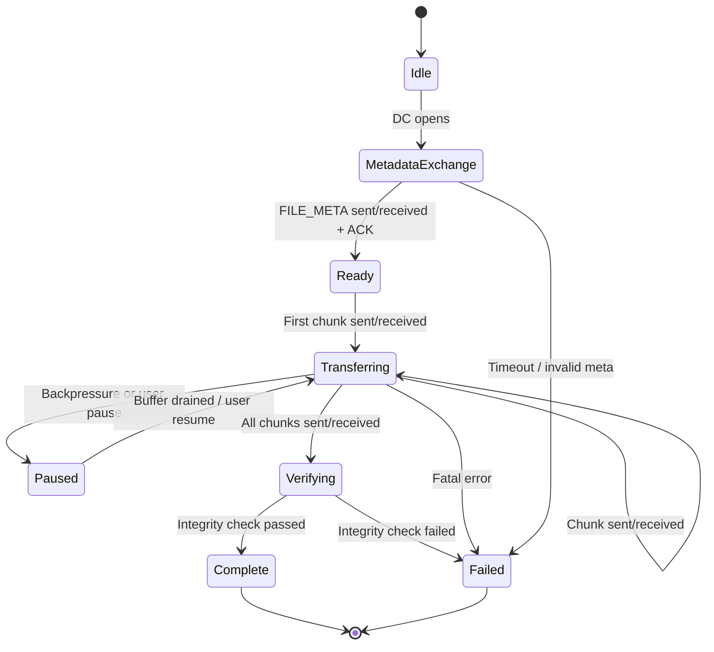
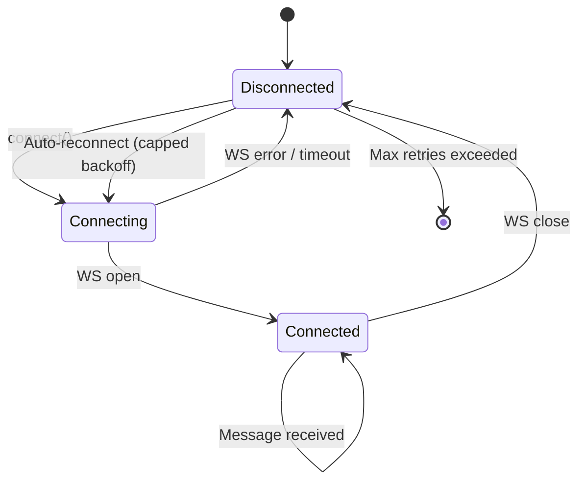

# nerdShare — State Machines

> Every stateful component in nerdShare defined as an explicit state machine.
> These prevent undefined behavior and guarantee clean lifecycle management.

---

## 1. Room State Machine (Signaling Server)

Manages the lifecycle of an ephemeral sharing room.



### States

| State             | Description                          | Invariants           |
| ----------------- | ------------------------------------ | -------------------- |
| `Created`         | Room entry exists, host WS connected | `peers.size === 0`   |
| `WaitingForPeers` | Host present, no active peers        | `hostWs !== null`    |
| `Active`          | Host + at least one peer present     | `peers.size >= 1`    |
| `Closed`          | Room is being cleaned up             | No messages accepted |

### Transitions

| From              | Event                 | To                            | Side Effects                              |
| ----------------- | --------------------- | ----------------------------- | ----------------------------------------- |
| `*`               | `JOIN_ROOM` (host)    | `Created`                     | Create room, register host WS             |
| `Created`         | Registration complete | `WaitingForPeers`             | Start TTL timer                           |
| `WaitingForPeers` | `JOIN_ROOM` (peer)    | `Active`                      | Register peer, notify host `PEER_JOINED`  |
| `Active`          | `JOIN_ROOM` (peer)    | `Active`                      | Register peer, notify host `PEER_JOINED`  |
| `Active`          | Peer WS close         | `Active` or `WaitingForPeers` | Remove peer, notify host `PEER_LEFT`      |
| Any               | Host WS close         | `Closed`                      | Notify all peers `PEER_LEFT`, remove room |
| Any               | TTL expires           | `Closed`                      | Notify all peers `ERROR`, remove room     |

### Room Data Structure

```typescript
interface Room {
  roomId: string;
  state: "waiting" | "active" | "closed";
  createdAt: number;
  expiresAt: number;
  hostId: string;
  hostWs: WebSocket;
  peers: Map<string, WebSocket>; // peerId → WS
  maxPeers: number; // default: 1 (MVP), 5 (Phase 3)
  ttlTimerId: Timer;
}
```

---

## 2. WebRTC Connection State Machine (Client)

Manages the lifecycle of a single `RTCPeerConnection` between host and one peer.



### States

| State          | Description                          | UI Indication                            |
| -------------- | ------------------------------------ | ---------------------------------------- |
| `Idle`         | No connection attempt                | "Waiting for peer" or "Ready to connect" |
| `Signaling`    | SDP/ICE exchange in progress         | "Connecting…" spinner                    |
| `Connecting`   | ICE connectivity checks in progress  | "Establishing connection…"               |
| `Connected`    | DataChannel open, ready for transfer | "Connected" ✓                            |
| `Transferring` | Chunks actively being sent/received  | Progress bar                             |
| `Done`         | Transfer complete                    | "Download ready" ✓                       |
| `Disconnected` | Temporary ICE disconnect             | "Reconnecting…"                          |
| `Failed`       | Unrecoverable failure                | Error message + retry button             |

### Connection Event Mapping

```typescript
// Map browser events to state transitions
pc.onconnectionstatechange = () => {
  switch (pc.connectionState) {
    case "connecting":
      setState("connecting");
      break;
    case "connected":
      setState("connected");
      break;
    case "disconnected":
      setState("disconnected");
      break;
    case "failed":
      setState("failed");
      break;
    case "closed":
      cleanup();
      break;
  }
};

pc.oniceconnectionstatechange = () => {
  // ICE-specific state for finer diagnostics
  console.log("ICE state:", pc.iceConnectionState);
};

dc.onopen = () => setState("connected");
dc.onclose = () => handleChannelClose();
dc.onerror = (e) => handleChannelError(e);
```

---

## 3. File Transfer State Machine (Client — per peer)

Tracks the progress of sending or receiving a file for one peer connection.



### States (Host / Sender)

| State              | What's happening                          | Key data               |
| ------------------ | ----------------------------------------- | ---------------------- |
| `Idle`             | Waiting for DataChannel to open           | —                      |
| `MetadataExchange` | Sent `FILE_META`, waiting for `HELLO_ACK` | fileMeta               |
| `Ready`            | ACK received, ready to send               | —                      |
| `Transferring`     | Sending chunks via `dc.send()`            | currentChunk, progress |
| `Paused`           | `bufferedAmount > HIGH_WATERMARK`         | pausedAt               |
| `Verifying`        | All chunks sent, waiting for peer confirm | —                      |
| `Complete`         | Transfer confirmed done                   | totalTime, avgSpeed    |
| `Failed`           | Unrecoverable error                       | errorMessage           |

### States (Peer / Receiver)

| State              | What's happening                          | Key data                 |
| ------------------ | ----------------------------------------- | ------------------------ |
| `Idle`             | Waiting for DataChannel                   | —                        |
| `MetadataExchange` | Received `FILE_META`, sending `HELLO_ACK` | fileMeta                 |
| `Ready`            | ACK sent, waiting for first chunk         | —                        |
| `Transferring`     | Receiving chunks via `dc.onmessage`       | receivedChunks, progress |
| `Verifying`        | All chunks received, checking integrity   | —                        |
| `Complete`         | File assembled, download triggered        | blob                     |
| `Failed`           | Error during receive                      | errorMessage             |

### Transfer State Data

```typescript
interface TransferState {
  state:
    | "idle"
    | "metadata"
    | "ready"
    | "transferring"
    | "paused"
    | "verifying"
    | "complete"
    | "failed";

  // Progress tracking
  totalChunks: number;
  currentChunk: number;
  bytesTransferred: number;
  startTime: number;

  // Backpressure (sender only)
  isPaused: boolean;
  pauseCount: number;

  // Error handling
  error?: string;
  retryCount: number;
}
```

---

## 4. Signaling Client State Machine (Client)

Manages the WebSocket connection to the signaling server.



### Reconnection Strategy

```typescript
const RECONNECT_CONFIG = {
  maxRetries: 5,
  baseDelayMs: 1000,
  maxDelayMs: 30000,
  backoffMultiplier: 2,
};

function getReconnectDelay(attempt: number): number {
  const delay =
    RECONNECT_CONFIG.baseDelayMs *
    Math.pow(RECONNECT_CONFIG.backoffMultiplier, attempt);
  return Math.min(delay, RECONNECT_CONFIG.maxDelayMs);
}
// Delays: 1s, 2s, 4s, 8s, 16s → cap at 30s
```

---

## 5. Combined System State (Zustand)

All state machines are composed in the Zustand store:

```typescript
interface AppState {
  // Signaling
  signalingStatus: "disconnected" | "connecting" | "connected";
  roomId: string | null;

  // Role
  role: "host" | "peer" | null;

  // File (host only)
  selectedFile: File | null;
  fileMeta: FileMeta | null;

  // Connections (host: multiple, peer: single)
  peerSessions: Map<
    string,
    {
      connectionState: ConnectionState;
      transferState: TransferState;
    }
  >;

  // UI
  error: string | null;
  shareLink: string | null;
}
```

### State Invariants (Must Never Be Violated)

| Invariant                      | Assertion                                                                   |
| ------------------------------ | --------------------------------------------------------------------------- |
| No transfer without connection | `transferState !== "transferring"` unless `connectionState === "connected"` |
| No file without room           | `selectedFile !== null` implies `roomId !== null`                           |
| Host has file                  | `role === "host"` implies `selectedFile !== null`                           |
| Peer has no file               | `role === "peer"` implies `selectedFile === null`                           |
| Room has exactly one host      | Server enforces: `room.hostId` is set once                                  |
